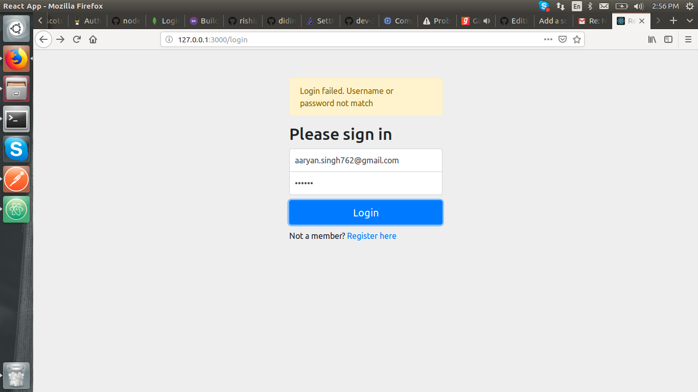
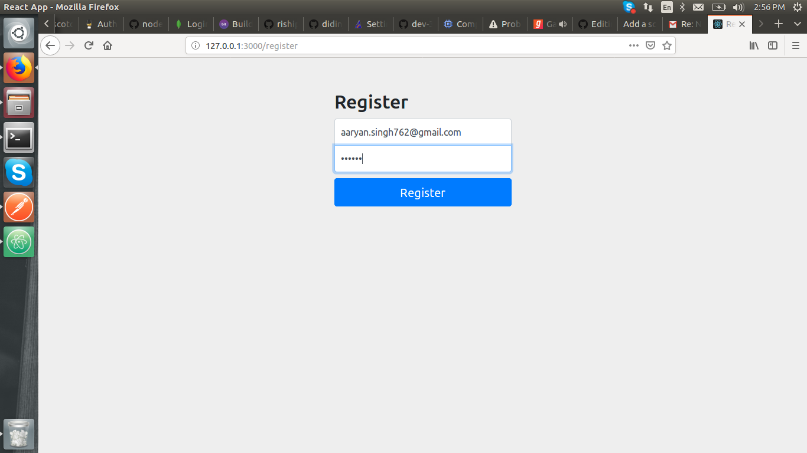
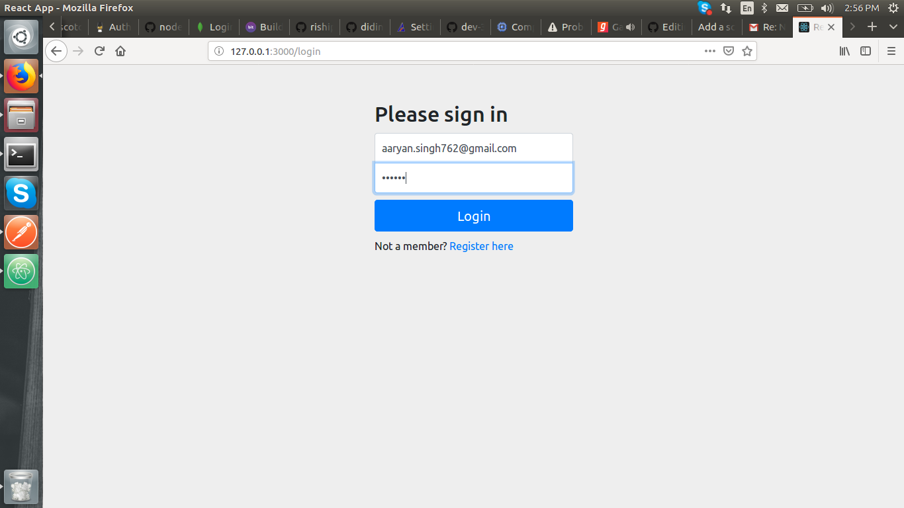
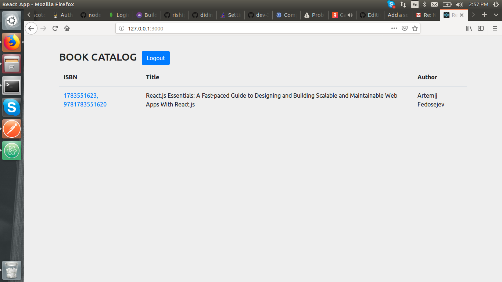

# Node-React-App

- Express
- Mongodb
- React
- Passport

- Run - nodemon

- Run - http://localhost:3000

- Click on register (register your email and password)

- Now login again

- You can see now book-details

